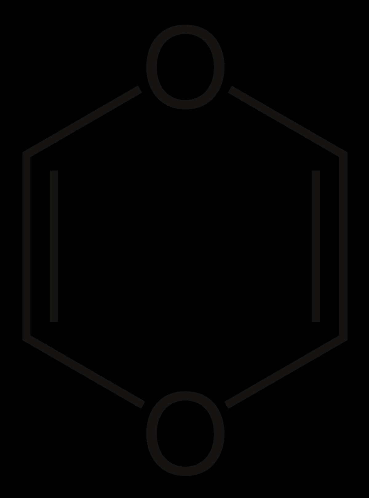

---
## Configure page content in wide column
title: "Why Dioxines Lab?" # leave blank to exclude
number_featured: 1 # pulling from mainSections in config.toml
use_featured: false # if false, use most recent by date
number_categories: 3 # set to zero to exclude
show_intro: true
intro: |
  The mission of the Dioxines Lab is.
  
  The vision of the lab is.
  
  The members of the Lab are:
  
AAA 

Lorem ipsum dolor sit amet, consectetur adipiscing elit, sed do eiusmod tempor incididunt ut labore et dolore magna aliqua. Ut enim ad minim veniam, quis nostrud exercitation ullamco laboris nisi ut aliquip ex ea commodo consequat. Duis aute irure dolor in reprehenderit in voluptate velit esse cillum dolore eu fugiat nulla pariatur. Excepteur sint occaecat cupidatat non proident, sunt in culpa qui officia deserunt mollit anim id est laborum.
  
 

Lorem ipsum dolor sit amet, consectetur adipiscing elit, sed do eiusmod tempor incididunt ut labore et dolore magna aliqua. Ut enim ad minim veniam, quis nostrud exercitation ullamco laboris nisi ut aliquip ex ea commodo consequat. Duis aute irure dolor in reprehenderit in voluptate velit esse cillum dolore eu fugiat nulla pariatur. Excepteur sint occaecat cupidatat non proident, sunt in culpa qui officia deserunt mollit anim id est laborum.
  
  
  
  
show_outro: true
outro: |
  <i class="fas fa-glass-cheers pr2"></i>Sincere thanks to **all the members of the lab** for their help naming this website work!
---

** index doesn't contain a body, just front matter above.
See about/list.html in the layouts folder **